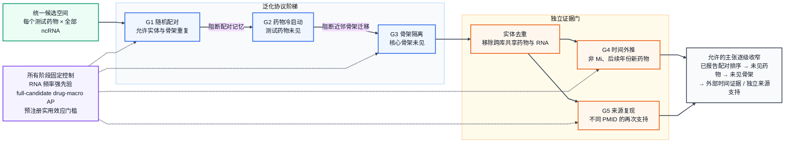

# 评估阶梯图

这张图区分协议强度与证据独立性：随机配对、药物冷启动和骨架隔离形成结构泛化阶梯；实体去重之后，时间外推和不同 PMID 复现构成两条互补的外部证据门。所有阶段都与同一强先验比较，并采用完整候选集上的 drug-macro AP。

```mermaid
%%{init: {"theme": "base", "themeVariables": {"background": "#FFFFFF", "fontFamily": "Arial, Helvetica, sans-serif", "primaryTextColor": "#111827", "lineColor": "#374151"}, "flowchart": {"curve": "linear", "nodeSpacing": 34, "rankSpacing": 48}}}%%
flowchart LR
    input["统一候选空间<br/>每个测试药物 × 全部 ncRNA"]

    subgraph protocol["泛化协议阶梯"]
        direction LR
        pair["G1 随机配对<br/>允许实体与骨架重复"]
        entity["G2 药物冷启动<br/>测试药物未见"]
        scaffold["G3 骨架隔离<br/>核心骨架未见"]
        pair -->|"阻断配对记忆"| entity
        entity -->|"阻断近邻骨架迁移"| scaffold
    end

    subgraph evidence["独立证据门"]
        direction TB
        overlap["实体去重<br/>移除跨库共享药物与 RNA"]
        temporal["G4 时间外推<br/>非 Mi、后续年份新药物"]
        source["G5 来源复现<br/>不同 PMID 的再次支持"]
        overlap --> temporal
        overlap --> source
    end

    control["所有阶段固定控制<br/>RNA 频率强先验<br/>full-candidate drug-macro AP<br/>预注册实用效应门槛"]
    claim["允许的主张逐级收窄<br/>已报告配对排序 → 未见药物 → 未见骨架<br/>→ 外部时间证据 / 独立来源支持"]

    input --> pair
    scaffold --> overlap
    temporal --> claim
    source --> claim
    control -.-> pair
    control -.-> scaffold
    control -.-> temporal
    control -.-> source

    classDef inputStyle fill:#ECFDF5,stroke:#059669,stroke-width:2px,color:#111827;
    classDef protocolStyle fill:#EFF6FF,stroke:#2563EB,stroke-width:2px,color:#111827;
    classDef evidenceStyle fill:#FFF7ED,stroke:#EA580C,stroke-width:2px,color:#111827;
    classDef controlStyle fill:#F5F3FF,stroke:#7C3AED,stroke-width:2px,color:#111827;
    classDef outputStyle fill:#F9FAFB,stroke:#374151,stroke-width:2px,color:#111827;
    class input inputStyle;
    class pair,entity,scaffold protocolStyle;
    class overlap,temporal,source evidenceStyle;
    class control controlStyle;
    class claim outputStyle;
    style protocol fill:#F8FAFC,stroke:#93C5FD,stroke-width:1px
    style evidence fill:#FFFBEB,stroke:#FDBA74,stroke-width:1px
    linkStyle default stroke:#374151,stroke-width:2px;
```
